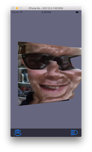
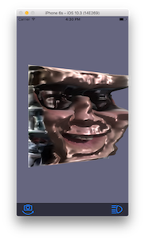
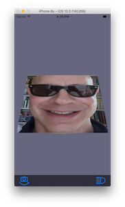
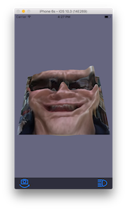
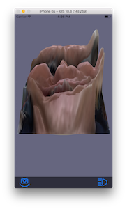

FacetiousIOS
============

By Philip M. Hubbard, 2017

Overview
--------

FacetiousIOS is an interactive art app for iOS devices written in Swift.  It tracks a face in video from the camera, and renders a warped version of that face.  The warping uses the face's luminance ("brightness") as the heights in a height field ("mountain range").  The results can range from comical to mildly disconcerting.  FacetiousIOS is implemented using the [SCamera](http://github.com/philiphubbard/SCamera), [SGL](http://github.com/philiphubbard/SGL), and [SUtility](http://github.com/philiphubbard/SUtility) frameworks.  FacetiousIOS is loosely based on [Facetious](http://github.com/philiphubbard/Facetious), and earlier macOS application written in C++.

User Interface
--------------

By default, the app uses the front camera.  The button on the left of the toolbar toggles between the front and the back cameras.  With either camera, the face tracker does not work very well in low-light or backlit conditions.

The button on the right of the toolbar toggles between two lighting models used in rendering the height field.  The default is the Ramamoorthi and Hanrahan algorithm for diffuse shading using spherical harmonics (see the left image, below).  The alternative is the Phong algorithm for specular shading with one directional light source (see the right image, below).

 

The pinch gesture scales the heights in the height map.  Unpinching ("smearing") lowers the heights, and pinching raises them.

  

The double-tap gesture resets the heights and returns to the default face image.

Implementation
--------------

The user interface elements are defined in the Main.storyboard file.  The main view controller is the custom `ViewController` subclass of `GLKViewController`.  There is a `UIToolbar` with two `UIBarButtonItem` and a `UILabel`, which appears when the camera is changed to display a message confirming the change.  Constraints enforce the placement of the elements.

The `ViewController` class is a subclass of `GLKViewController`.  It has methods with `@IBAction` annotations to handle the two `UIBarButtonItem` instances.  An `@IBOutlet` gives access to the `UILabel`, so its alpha can be animated to make it appear and then disappear.  The `UIPinchGestureRecognizer` and `UITapGestureRecognizer` are created by `ViewController` instead of in the Main.storyboard file, so Main.storboard can focus on visual elements.  Rendering is coordinated by an instance of the `Renderer` class (described below), and its `render` method is called by the overridden `glkView` method in the `ViewController`.  A key part of rendering involves video from the device's camera, and this video is provided by an instance of the `VideoHandler` class (described next).  To let the `VideoHandler` instance update the camera based on changes to the device orientation, `ViewController` overrides the `willTransition` method for `UITraitCollection`.

The `VideoHandler` class uses the [SCamera](http://github.com/philiphubbard/SCamera) framework to stream video from one or other of the device's cameras.  `VideoHandler` has a [SCamera](http://github.com/philiphubbard/SCamera) `Video` instance and conforms to the `VideoDelegate` protocol with a `captureOutput` method to receive the video frames.  This method uses a `CIDetector` to find a face in the latest frame.  It uses the `CIDetectorTracking` option and `CIFaceFeature.trackingID` value to continue tracking a face that was detected in an earlier frame, and if no face is being tracked, it starts tracking the face with the largest area.  The `CIDetector` cannot run at 60 Hz, so it runs asynchronously in its own dispatch queue, allowing rendering to continue at 60 Hz with animation involving the previously detected face.  The results of `CIDetector` also tend to be jittery, so `VideoHandler` smooths them with the `RunningAverage` class from the [SUtility](http://github.com/philiphubbard/SUtility) framework.

The `Renderer` class is the heart of the system.  It uses the [SGL](http://github.com/philiphubbard/SGL) framework to simplify the OpenGLES operations.  The height field for the warped face image is a [SGL](http://github.com/philiphubbard/SGL) `FlattishSquarePNT` at a resolution of 128 by 128 vertices.  A custom `LuminanceWarpingVertexShaderPNT` shader (described next) gives these vertices their heights based on luminance values from a texture of the face image.  That texture is represented by a [SGL](http://github.com/philiphubbard/SGL) `Texture` instance which gets loaded asynchronously with a `CGImage` from the `VideoHandler`.  At each frame, `Renderer` calls `swap` on this `Texture` so it gets the latest face image when the asynchronous loading is finished.  Another `FlattishSquarePNT` with a gentle sinusoidal "bulge" in the Z direction provides a back surface behind the height field.  The back surface uses a `BasicVertexShaderPNT` because it needs no texture-based warping.  Both surfaces use one of two fragment shaders, `PhongOneDirectionalFragmentShaderPNT` or `SphericalHarmonicsFragmentShaderPNT`, based on the user's choice.  The gentle back-and-forth rocking and up-and-down nodding of the two surfaces is described with an instance of the `Animation` class from the [SUtility](http://github.com/philiphubbard/SUtility) framework.  When the user presses the left toolbar button, the `Animation` is replaced with a "detour" that flips the surfaces completely around and back to the neutral position.  The detour's initial derivative matches that of the current `Animation`, thus providing a smooth transition.

The custom `LuminanceWarpingVertexShaderPNT` shader conforms to the [SGL](http://github.com/philiphubbard/SGL) `VertexShading` protocol, and uses `VariablesPNT` to manage attributes for positions, normals and texture coordinates.  It also uses a custom `VariablesLuminanceWarping` to manage a `Uniform1f` for the overall height scale of the height field, which the user can change with the pinch gesture.  Most of the functionality other than the GLSL code is provided by an instance of the [SGL](http://github.com/philiphubbard/SGL) `ShadingCore` class.  The GLSL code uses a `sampler2D` to get the bound face texture.  At each vertex, it uses `textureOffset` to average the luminance values in a four-by-four area; doing so smooths the height field a bit, which tends to make it look more aesthetically appealing.  This initial height is then scaled by the `Uniform1f` from the `VariablesLuminanceWarping`.  To generate approximate normal vectors for the height field, the GLSL code uses finite differences.

The `AppDelegate` is trivial, as this app has no lifecycle management needs.

Testing
-------

FacetiousIOS has no unit tests of its own.  The [SGL](http://github.com/philiphubbard/SGL) and [SUtility](http://github.com/philiphubbard/SUtility) frameworks it uses have good test coverage, though.

Building
--------

FacetiousIOS includes an Xcode workspace file, FacetiousIOS.xcworkspace, to load the app's code and the dependent frameworks: [SCamera](http://github.com/philiphubbard/SCamera), [SGL](http://github.com/philiphubbard/SGL), and [SUtility](http://github.com/philiphubbard/SUtility).  The directories for those frameworks are meant to be siblings of the top-level FacetiousIOS directory.

If, for some reason, the workspace does not work and must be set up manually, the following steps are helpful for adding one of the dependent frameworks (using [SGL](http://github.com/philiphubbard/SGL) as an example):

1. Close the SGL project if it is open in Xcode.
2. Open the workspace.
3. In the Project Navigator panel on the left side of Xcode, right-click and choose "Add Files to <workspace name>..."
4. In the dialog, from the "SGL" folder choose "SGL.xcodeproj" and press "Add".
5. Select the app project in the Project Navigator, and in the "General" tab’s "Linked Frameworks and Libraries", press the "+" button.
6. In the dialog, from the "Workspace" folder choose "SGL.framework" and press "Add".
7. In the "Build Phase" tab, press the "+" button (top left) and choose "New Copy Files Phase."  This phase will install the framework when the app is installed on a device.
8. In the "Copy Files" area, change the "Destination" to "Frameworks".
9. Drag into this "Copy Files" area the "SGL.framework" file from the "Products" folder for SGL in the Project Navigator.  Note that it is important to *drag* the framework from the "Products" folder: the alternative---pressing the "+" button in the "Copy Files" area and choosing any of the "SGL.framework" items listed---will appear to work but will fail at run time.
10. In the dialog that appears after dragging, use the default settings (i.e., only "Create folder references" is checked) and press "Finish".

The specific version of Xcode used to develop FacetiousIOS was 8.3.
